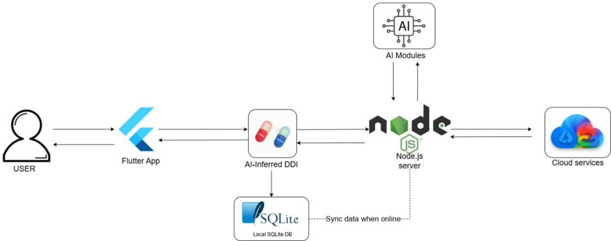

[](https://classroom.github.com/a/nRcUn8vA)
# UmiDo: AI-Powered Smart Notification System

An intelligent, cross-domain task management and notification system designed to help users coordinate responsibilities across healthcare, work, and personal life. By leveraging AI and Natural Language Processing (NLP), the system simplifies task management, resolves scheduling conflicts, and enhances user productivity and safety.

---

## Background (프로젝트 배경)

### Market Situation & Problem Statement

In today's fast-paced world, individuals struggle to manage multiple responsibilities across different life domains. Existing task management tools are often specialized for a single purpose. For instance, **Medisafe** is excellent for medical reminders but lacks general task management features, while **Trello** is effective for work projects but offers no support for healthcare needs. This forces users to juggle multiple, disconnected applications, leading to inefficiencies, missed commitments, and reduced productivity. There is a clear gap in the market for a holistic solution that integrates these different domains intelligently.

### Necessity & Expected Impact

This project is necessary to address the shortcomings of current task management systems by providing a single, integrated platform. UmiDo aims to be a proactive assistant that helps users manage the complexities of modern life. The expected effects include:
* **Enhanced Productivity**: By centralizing tasks and automatically detecting conflicts, users can manage their time more effectively.
* **Improved Health Outcomes**: With features like medication reminders and Drug-Drug Interaction (DDI) checks, the system promotes medical compliance and safety.
* **Greater Accessibility**: A user-friendly interface is designed to be accessible for users with varying levels of digital literacy, including the elderly.

---

## Goals (개발 목표)

### Overall Objective & Features

The overall goal is to develop a reliable and adaptive AI-powered notification system. Key features and planning contents include:
* **Secure Multi-Role Authentication**: A system that supports different user roles such as Doctor, Manager, Patient, and Normal User with appropriate access controls.
* **AI-Powered Task Parsing**: Using NLP to extract structured task information from unstructured user inputs, such as text messages or prescription images.
* **Advanced Conflict Detection**: A module that identifies potentially harmful drug-drug interactions.
* **Intelligent Chatbot Assistant**: A conversational AI that can answer user queries about tasks, schedules, and medications.
* **Robust Notification System**: A system to deliver timely alerts for tasks and critical events without being intrusive.
* **Offline Functionality**: The ability for users to view and manage tasks even without an internet connection, with data synchronizing once reconnected.

### Differentiation vs. Similar Services

UmiDo distinguishes itself by offering a truly integrated, cross-domain solution. Unlike specialized apps, it combines health, work, and personal task management into a single, intelligent platform.

| Feature | Medisafe | Trello | **UmiDo** |
| :--- | :---: | :---: | :---: |
| Medical task reminders (pills, prescriptions) | ✅ | ❌ | ✅ |
| Work/project task management | ❌ | ✅ | ✅ |
| **Drug-Drug Interaction (DDI) safety checking** | ❌ | ❌ | ✅ |
| **AI/NLP for natural task input (text, prescription)** | ❌ | ❌ | ✅ |
| **Chatbot assistance** | ❌ | ❌ | ✅ |
| **Cross-domain task integration (health + work)** | ❌ | Partial | ✅ |
| Offline support with local DB sync | Limited | ✅ | ✅ |
| **Real-time conflict detection (schedule + medication)** | ❌ | ❌ | ✅ |
| Role-based access (doctor, manager, patient) | ❌ | Limited | ✅ |
*Table based on the comparative analysis in the report.*

### Social value / sustainability aspects
The project aims to create positive social value by:
* **Promoting Public Health and Safety**: The integrated Drug-Drug Interaction (DDI) module, trained on official data from the Ministry of Food and Drug Safety (MFDS), directly contributes to medication safety for all users.
* **Enhancing Accessibility for Vulnerable Groups**: By focusing on a simple, intuitive UI, the system is designed to be usable by elderly individuals and those with low digital literacy, helping them manage their health and daily tasks more independently.
* **Improving Healthcare Adherence**: The system provides tools for doctors and caregivers to monitor patient task completion, which is particularly important for medical compliance.

---

## System Design (시스템 설계)

### Architecture Diagram

Our system is designed around a centralized backend that communicates with the client application and various cloud services. The architecture supports both online and offline functionality.



* **Flutter App (Client)**: The cross-platform user interface for Android and web.
* **Backend (Node.js Server)**: Hosted on Microsoft Azure, it handles all business logic, API requests, and data processing. It includes the AI/NLP modules for intelligent processing.
* **Databases**:
    * **Microsoft Azure SQL Database**: The primary relational database for storing all user and task data securely.
    * **SQLite**: A local database on the client device to enable full offline functionality.
* **Cloud Services**:
    * **Google Cloud Services / Firebase Cloud Messaging (FCM)**: Used to deliver real-time push notifications for reminders and messages.

### Technologies Used

| Category | Technology | Purpose |
| :--- | :--- | :--- |
| **Backend** | Node.js with the Express.js framework | Core application logic, user authentication, data processing, and API requests. |
| **Frontend** | Flutter | Cross-platform mobile and web development for a consistent user experience. |
| **Primary Database** | Microsoft Azure SQL Database | Primary relational database for storing all user and task data securely. |
| **Offline Database** | SQLite | Local database on the client device for offline functionality. |
| **Hosting** | Microsoft Azure App Services | Hosting the backend Node.js server. |
| **Push Notifications** | Firebase Cloud Messaging (FCM) | Delivering real-time push notifications for reminders and messages. |
| **AI/NLP** | Custom models (Gradient Boosting for DDI, fine-tuned KOBART for parsing), Gemini API | AI-powered task parsing, drug-drug interaction detection, and intelligent chatbot functionality. |

---

## Results (개발 결과)

### Overall System Flow

The system operates through several key interactions:
1.  **Client-Server Communication**: The Flutter app sends requests (e.g., create a task) to the Node.js backend API. The backend processes the request, interacts with the database, and returns a response to update the UI.
2.  **Offline Functionality**: If the user is offline, the Flutter app writes data to a local SQLite database. When connectivity is restored, a sync service updates the central Azure SQL Database.
3.  **Push Notifications**: For timely alerts, the backend sends a request to Firebase Cloud Messaging (FCM), which delivers a push notification to the user's device.
4.  **AI Processing**: For tasks like prescription parsing or chatbot queries, the backend utilizes its integrated AI modules or calls an external LLM API to process the input and generate a structured response.

### Detailed Feature Descriptions

#### Core User Platform (Flutter & Node.js Backend)

* **Full Authentication System**: User authentication is managed by the Node.js backend using JSON Web Tokens (JWT). This provides a secure and complete user experience, including registration, login, and access control based on roles (Doctor, Manager, Normal, Mixed).
* **Task Management (CRUD Operations)**: The system supports core functionalities for task creation, retrieval, updating, and deletion. Automated task processing is emphasized, but manual task addition is also supported.
* **Real-time Dashboard**: Instead of static periodic reports, a real-time dashboard was developed to visualize task adherence, completion rates, and system analytics. Task history tracking is incorporated as a core feature.
* **Messaging Module**: Provides a secure and direct communication channel between assigned users (e.g., doctor and patient) for task-related discussions, complementing the automated notification system.

#### AI-Powered Itinerary Engine (AI/NLP Modules)

* **Drug-Drug Interaction (DDI) Module**:
    * **Input**: A pair of medications.
    * **Processing**: This module uses a Gradient Boosting machine learning model trained on a proprietary dataset derived from the Korean Ministry of Food and Drug Safety (MFDS). It analyzes the drug pair based on chemical similarity, biological targets, and other features.
    * **Output**: A JSON object indicating the interaction probability and severity level (e.g., Minor, Moderate, Severe).
* **Prescription Parser Module**:
    * **Input**: An image of a prescription.
    * **Processing**: The module uses a multi-stage pipeline. It first uses the Upstage Information Extractor to identify key entities, then applies fuzzy string matching to validate medication names, and finally uses a fine-tuned KOBART NLP model to parse dosage instructions.
    * **Output**: A structured JSON object containing patient info, medications, dosage, frequency, and duration.
* **Chatbot Module**:
    * **Input**: A user's text query.
    * **Processing**: The chatbot uses a multi-tiered pipeline. It first attempts to match the query using fast, rule-based methods. If that fails, it uses more flexible fuzzy matching. For complex or ambiguous requests, it falls back to the Gemini LLM API for a context-aware response.
    * **Output**: A human-readable text response, delivered in a JSON object that also details the processing path taken.

### Directory structure
```
.
├── android  
│   ├── app  
│   ├── build.gradle.kts  
│   ├── gradle  
│   ├── gradle.properties  
│   ├── gradlew  
│   ├── gradlew.bat  
│   ├── local.properties  
│   └── settings.gradle.kts  
├── archi.png  
├── assets  
│   ├── background.png  
│   ├── ddi.csv  
│   ├── medications.csv  
│   └── UmiDo.png  
├── devtools_options.yaml  
├── firebase.json   
├── lib  
│   ├── effects  
│   ├── firebase_options.dart  
│   ├── main.dart  
│   ├── models  
│   ├── providers  
│   ├── repositories  
│   ├── screens  
│   ├── services  
│   ├── utils  
│   └── widgets  
├── node
│   ├── config  
│   ├── node_modules  
│   ├── package.json  
│   ├── package-lock.json  
│   ├── python  
│   ├── routes  
│   ├── server.js  
│   ├── uploads  
│   └── utils  
├── pubspec.lock  
├── pubspec.yaml  
├── web  
│   ├── favicon.png  
│   ├── icons  
│   ├── index.html  
│   └── manifest.json  
└── windows  
    ├── CMakeLists.txt  
    ├── flutter  
    └── runner  
```

### Mentor Feedback & Applied Changes

#### **Concern 1: Limited Access to Real User Data**

* **Initial Constraint**: The system's ability to process real user input—especially medical instructions and task data—was initially constrained by the lack of real-world datasets. Synthetic data was used for early development.
* **Our Response**: Synthetic datasets were refined to better simulate realistic user behavior. Plans were made to gradually incorporate anonymized and ethically sourced real user data after deployment to improve system accuracy while maintaining privacy.

#### **Concern 2: Simplistic Database Model**

* **Initial Constraint**: The initial plan to use Firebase Firestore's schema-less NoSQL model lacked the relational consistency, complex query support, and transactional reliability required for handling medical and work-related data.
* **Our Response**: The backend data store was transitioned from Firebase Firestore to a Microsoft Azure SQL Database. A modular schema design was adopted, supported by version-controlled migration scripts, to ensure robust, transaction-safe operations and strict data consistency.

#### **Concern 3: Offline Synchronization Complexity**

* **Initial Constraint**: Ensuring a seamless offline experience without compromising data consistency was a significant technical challenge, particularly when syncing changes after reconnection.
* **Our Response**: A combination of UUID-based identifiers and timestamp-based versioning was implemented to support offline operation. This ensures global uniqueness for tasks and applies conflict resolution for updates, notifying users for manual confirmation when automatic resolution isn't possible.

#### **Concern 4: Chatbot Framework Selection**

* **Initial Constraint**: Multiple chatbot frameworks (e.g., Rasa, spaCy) were under evaluation, leading to potential integration and maintenance challenges.
* **Our Response**: A hybrid chatbot approach was adopted, where lightweight preprocessing with keyword extraction and fuzzy matching is used to quickly handle routine queries. More complex or ambiguous inputs are routed to the Gemini API LLM for context-aware responses, balancing efficiency with the flexibility and accuracy of advanced NLP.

## Installation/Run Guide (설치 및 실행 방법)

This project requires **two terminals** to run the frontend and the Flutter app simultaneously.

---

### 1️⃣ Frontend (Node.js)

1. Open a terminal and navigate to the `node/` directory:
    ```bash
    cd node/
    ```
2. Install dependencies:
    ```bash
    npm install
    ```
3. Start the frontend server:
    ```bash
    npm start
    ```
- The frontend will run on **port 3000** by default.

---

### 2️⃣ Flutter (Mobile or Web)

1. Open a second terminal.
2. For **Android device**, run:
    ```bash
    flutter run
    ```
    - Make sure your Android phone is connected via USB with debugging enabled.
3. For **Web**, run:
    ```bash
    flutter run -d chrome --web-port 8080
    ```

---

### 3️⃣ Important Notes

- Due to `.env` limitations and Azure SQL firewall rules:
  1. You must request access via **equkid@pusan.ac.kr** to add your current IP to the firewall.  
  2. Access to the `.env` file is also granted via the same email.
- Update the URL in `lib/utils/constants.dart` to your **local machine IP** (example: `192.168.x.x`) for proper connection.

---

### Service Ports

| Service | Port | Local URL |
| :--- | :--- | :--- |
| **Node.js** | `3000` | `http://localhost:3000` |
| **Flutter Web** | `8080` | `http://localhost:8080` |
| **Backend / API** | see `.env` | depends on setup |

---

## Video/Presentation Materials (소개 자료 및 시연 영상)

[](https://youtu.be/I-nckl0zJQ0?si=uXtpfT6PP4wAe0NS)

---

## Introduction and Division of Roles by Team Members

The project was developed by team **UmiZoomi**, consisting of two members:
* **Kadyrov Adilet**:
    * AI/NLP Module Development (Data Curation, Neural Network Parsing, Conversational AI).
    * Flutter UI Development (UI structure, navigation, core components).
    * Documentation and Reporting.
    * Backend and Database Development
* **Yegizbayev Zholan**:
    * Backend and Database Development (Firebase Integration, Microsoft Azure Deployment).
    * Backend Logic with Cloud Functions.
    * Offline Mode Implementation.

Both members collaborated on System Architecture Design and Feature Testing.

#### 7.2. Review of Participation by Team Member

### **Kadyrov Adilet**
> "Developing the AI/NLP modules and integrating them with the Flutter UI was a key challenge. Fine-tuning models for medication parsing and creating a conversational AI system required a deep dive into advanced NLP techniques. I learned the importance of robust data curation and establishing an MLOps pipeline for continuous model improvement. Seeing the system intelligently process natural language and provide meaningful responses was incredibly rewarding."

### **Yegizbayev Zholan**
> "My primary focus was on building a resilient and scalable backend infrastructure. The transition from Firebase to Microsoft Azure SQL and App Services was a critical decision that enhanced the system's reliability and security. Implementing the offline mode with SQLite and ensuring seamless data synchronization presented complex technical hurdles, but overcoming them solidified my understanding of distributed data consistency and robust system design. Collaborating closely with Adilet to integrate our modules was a fantastic experience."


***

### References and Sources

- J.Y. Ryu, H.U. Kim, & S.Y. Lee. (2018). Deep learning improves prediction of drug–drug and drug–food interactions. *Proceedings of the National Academy of Sciences of the United States of America, 115*(18), E4304–E4311. https://doi.org/10.1073/pnas.1803294115

- Kim, Y., Kim, J.H., Lee, J.M., Jang, M.J., Yum, Y.J., Kim, S., Shin, U., Kim, Y.M., Joo, H.J., & Song, S. (2022). A pre-trained BERT for Korean medical natural language processing. *Scientific Reports, 12*(1), 13847. https://doi.org/10.1038/s41598-022-17806-8  
  Erratum: *Scientific Reports, 13*(1), 9290. https://doi.org/10.1038/s41598-023-36519-0

- Mei, S., & Zhang, K. (2021). A machine learning framework for predicting drug–drug interactions. *Scientific Reports, 11*, 17619. https://doi.org/10.1038/s41598-021-97193-8

- Ministry of Food and Drug Safety (MFDS), Korea. (Accessed 2025). Drug approval and safety information database.
